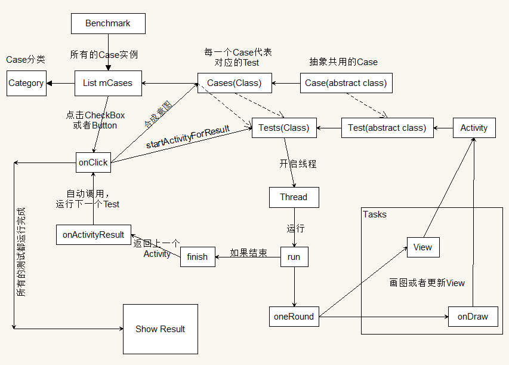
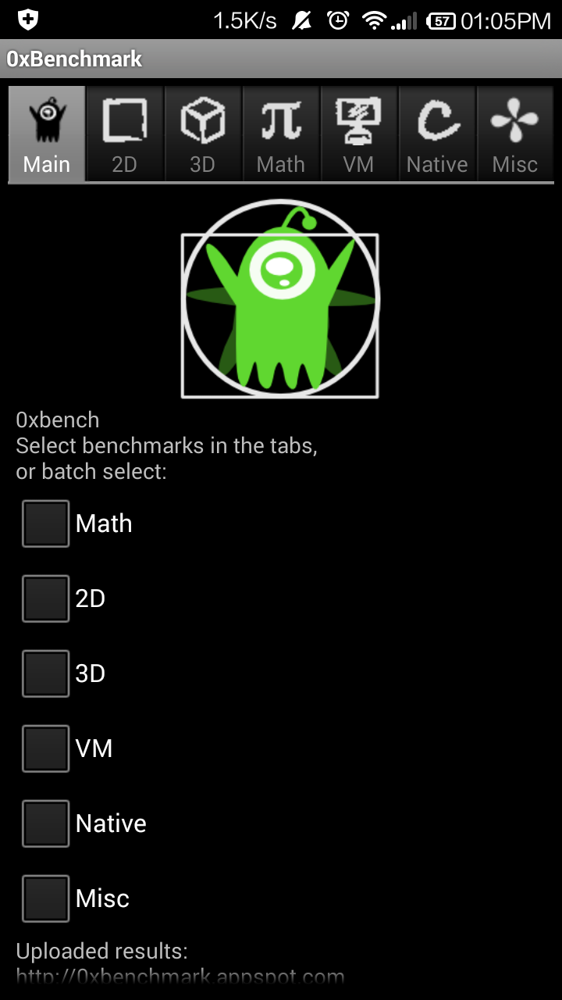

# AndroidBenchmark

这个项目拷贝[0xbench](https://code.google.com/archive/p/0xbench/)而来，但是拷贝下来发现有些包名好像不对，修改几个包名才能正常运行，这个项目可以用来研究Android Benchmark的测试方法。

## 说明

从[google仓库](https://code.google.com/archive/p/0xbench/)中下载了源代码，用ADT打开，发现很多地方包不正常，于是重新修改了包名，软件是能够正常运行的。
现在已经将项目换成Android Studio项目。

## 软件运行架构原理

由于最近有点时间，于是对这个软件运行的架构进行解读，当然这代码中的很多内容属于过时的，虽然是这么说，但处理事情的思想是不会过时的。

## 软件运行情况

